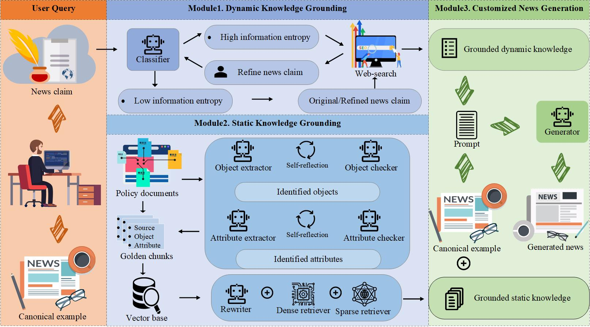

# DOSP-RAG: Semi-Parametric Retrieval-Augmented Generation via Dual-Optimization for Controllable Meteorological Warning News Generation
Large language models (LLMs) have shown remarkable capabilities in natural language generation (NLG) tasks, like text summarization and machine translation. However, the hallucination issues of LLMs have curtailed their performance in controllable NLG tasks, like customized meteorological warning
news generation (CMWNG), which aligns lasted meteorological facts with professional writing-style to generate fact-consistent and style-enriched news. Retrieval-augmented generation (RAG) holds significant promise for enhancing LLMs in CMWNG by plugging the knowledge corpora that are factual and cus-
tomizable. Nonetheless, the existing RAG models, primarily optimized for question-answering (QA) system, have inadver-
tently narrowed the versatility of LLMs, particularly in customizable responses. Note that the growing need for reliable
and personalized news content highlights RAG’s potential in CMWNG, yet research into its capabilities for CMWNG remains
largely unexplored. Hence, we propose a novel dual-optimized semi-parametric RAG framework (DOSP-RAG). Our framework
firstly develops a knowledge grounding architecture via dual- optimization perspective to distill high-quality external knowl-
edge. Furthermore, one-shot style learning enables the generation of trustworthy news injected with a customized style during
the inference phase. Through extensive quantitative evaluations conditioned on real-world datasets, our method shows state-of-
the-art performance in news generation. Furthermore, additional human evaluations verify the effectiveness in controlling style
alignment within CMWNG.



## Installation
Install dependent Python libraries by running the command below.

```
pip install -r requirements.txt
```
## Quick start
When you provide your API kEY in the .env file, you can use DOSP-RAG for CMWNG by running the command below in the linux terminal

```
python main_chain.py
```


